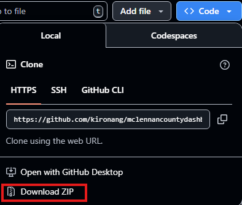

# McLennan County Dashboard
This repository provides an organized system for visualizing common public health datasets. Local health districts can use the code in this repository to create online dashboards for public access. Although the current state of the repository showcases methods for McLennan County, the manual below contains instructions for simple transitions to other counties in the United States.

Version 0.2.0, 2025-July-21:
```
├── LICENSE
├── README.md
├── dashboard
|     ├── app.r
├── data
|     ├── DiabetesAtlas_CountyData (1).csv
|     ├── DiabetesAtlas_CountyData (2).csv
|     ├── DiabetesAtlas_CountyData (3).csv
|     ├── DiabetesAtlas_CountyData (4).csv
|     ├── DiabetesAtlas_CountyData (5).csv
|     ├── DiabetesAtlas_CountyData (6).csv
|     ├── DiabetesAtlas_CountyData (7).csv
|     ├── DiabetesAtlas_CountyData (8).csv
|     ├── DiabetesAtlas_CountyData (9).csv
|     ├── DiabetesAtlas_CountyData.csv
|     ├── data.csv
|     ├── data.r
|     ├── indicators.csv
```

Kiron created this public health dashboard for a Summer 2025 internship with the Waco-McLennan Public Health District. It relies on the R programming language and the Shiny application framework. It also features the GNU Affero General Public License v3.0.

Kiron tested the code in this repository with version 4.5.1 of the R programming language. Additionally, Kiron compiled the data from several different online sources:
- https://gis.cdc.gov/grasp/diabetes/diabetesatlas-surveillance.html
- https://chronicdata.cdc.gov/Heart-Disease-Stroke-Prevention/Rates-and-Trends-in-Heart-Disease-and-Stroke-Morta/7b9s-s8ck
- https://data.cdc.gov/500-Cities-Places/PLACES-Local-Data-for-Better-Health-County-Data-20/dv4u-3x3q
- https://data.cdc.gov/500-Cities-Places/PLACES-Local-Data-for-Better-Health-County-Data-20/pqpp-u99h
- https://data.cdc.gov/500-Cities-Places/PLACES-Local-Data-for-Better-Health-County-Data-20/duw2-7jbt
- https://data.cdc.gov/500-Cities-Places/PLACES-Local-Data-for-Better-Health-County-Data-20/h3ej-a9ec
- https://data.cdc.gov/500-Cities-Places/PLACES-Local-Data-for-Better-Health-County-Data-20/swc5-untb
- https://www.countyhealthrankings.org/health-data/methodology-and-sources/data-documentation
- https://www.countyhealthrankings.org/health-data/methodology-and-sources/data-documentation/national-data-documentation-2010-2023

This repository represents the code corresponding to the version listed above. View this repository online at https://github.com/kironang. Kiron dedicated the rest of this document to instructions and guidance. Please contact Kiron at kiron_ang1@baylor.edu if you have any questions.

# User Manual
Good morning! Thank you for choosing this repository as a solution for your dashboard needs. My name is Kiron, and I'll be providing you with some guidance on how to maximize your county dashboard experience. First, I'll address any questions about testing the dashboard on your own computer, and then, I'll focus on what to do if you want to deploy the dashboard to an online website.

I've added images where appropriate to improve your experience. Please let me know if anything is outdated, incorrect, or unhelpful by contacting me at kiron_ang1@baylor.edu. Finally, please keep in mind that I firmly support open source information; I encourage you to do the same by publishing your code and data publicly, or at least by mentioning this repository.

One last note: This manual assumes that you have basic familiarity with R and RStudio. Additionally, I wrote this manual with my colleagues in mind, and all of them use Windows. Again, if anything is unclear, please send me an email and I'll be happy to help. With introductions out of the way, we will now begin!

## How can I run the dashboard on my computer?
Please read all of these instructions before deployment! In this section, not only do I provide instructions for local testing, but also I explain the data preparation needed to incorporate additional datasets.

First, open this website with your favorite web browser: https://github.com/kironang/mclennancountydashboard. Click on ``<> Code``, then click on ``Download ZIP``. See the image below for more information.



Open the folder where the ZIP file went and extract all its contents. A new directory called ``mclennancountydashboard-main`` should appear. 


At this point, please open RStudio and navigate into the folder until you see the README.md file.


If you're only interested in McLennan County, you can already run the app; just click into the ``dashboard`` folder and then open the ``app.r`` file. Click on the ``Run app`` button.


Once the app starts to run, you should immediately see the dashboard appear in a separate window.


If you want to change the indicator names, units, or categories, open and edit the indicators.csv file in Excel. This magical data structure made it super easy for me to merge different datasets together. The


- Population Health
- Access to Care
- Childcare and Education
- Demographics
- No Category
- Mortality
- Diseases and Lifestyle Conditions

If you're in a different county, delete the following files:
- data.csv
- indicators.csv
- All the ``DiabetesAtlas`` files

All the ``DiabetesAtlas`` files were downloaded from this CDC website after specifically selecting data for McLennan County: https://gis.cdc.gov/grasp/diabetes/diabetesatlas-surveillance.html. If you would like to incorporate this dataset, please specify your county on the website and download the CSV files you want to include. Then, move the CSV files back into the ``data`` folder. If you don't need this diabetes data, then just go to the ``data.r`` file and change ``use_diabetes_atlas <- TRUE`` to ``use_diabetes_atlas <- FALSE``.

Since you probably have ``data.r`` open already at this point, please change ``county <- "McLennan"`` and ``state_abbreviation <- "TX"`` as needed. Now, your ``data`` folder should be completely empty, except for a ``data.r`` file. In RStudio, click ``Source`` to run all the code in the ``data.r`` file. An indicators.csv file will be created for you. Edit the indicators.csv file as described above, and then source ``data.r`` again.

## How can I deploy the dashboard to a public-facing website?